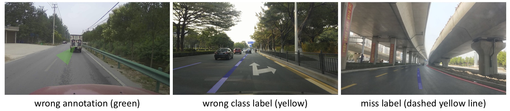

# Code for 2020 China Hualu Cup Data Lake Algorithm Competition (Lane Detection Track)

## Introduction
This repo contains the **first** place solution by the Incredible@NTU team for the Lane Detection Track of the 2020 China Hualu Cup Data Lake Algorithm
Competition. For more information about this task, we refer you to the 
official [website](https://dev.ehualu.com/dev/home/competition/competitionDetail?competitionId=1). In this competion, 
We adopt the [ERFNet](http://www.robesafe.uah.es/personal/eduardo.romera/pdfs/Romera17tits.pdf) as our base
model for its lightweight and large receptive field, which are critical factors in this task. Furthermore, we perform 
data cleaning, sky removing and weighted crossentropy loss as the main techniques along with several other tricks to 
achieve the compelling performance (42.25 mIoU on Final testB) in a highly efficient manner. No model ensemble is used 
in our solution. Finally, our solution won the champion out of 576 teams in this competition. An overview 
of our solution is available [here](https://pan.baidu.com/s/1UbcY6fa8h44aLljK-t8HOg) (passwd: shid).

## Updates
- Add `visualization.py` for label visualization. See [utils/README.md](utils/README.md) for details. (04/01/2021)

## Contents
1. [Installation](#installation)
2. [Datasets](#datasets)
3. [Training](#training)
4. [Evaluation](#evaluation)

## Installation
- [Anaconda3](https://repo.anaconda.com/archive/Anaconda3-2020.07-Linux-x86_64.sh)
- [PaddlePaddle 1.8.5](https://www.paddlepaddle.org.cn/documentation/docs/en/install/install_Ubuntu_en.html)
- OpenCV 4.2.0.32
- CUDA 10.0 or 10.1
- cuDNN 7.6.5
- TensorBoard (optional)
- pycocotools (optional)

Notes: 

- It may also run well on other versions but with no guarantee.

- TensorBoard is optional, just for recording training process. If not installed, feel free to comment relevant lines
of code.

- pycocotools is only required for visualization in `utils/visualization.py`.

For your convenience, we wrap up the installation process with the following commands.

```Shell
conda create -n paddle python=3.7 -y && conda activate paddle
pip install opencv-python==4.2.0.32
python -m pip install paddlepaddle-gpu==1.8.5.post107 -i https://mirror.baidu.com/pypi/simple
pip install pycocotools
```

## Datasets
We first construct our training set by combining the training data released in the preliminary and final round, which
consists of 15,503 training images in total. After that, data cleaning and preprocessing techniques (as described below)
are conducted to obtain higher quality training samples, resulting in 15,170 training images finally.

1. We manually filter out or re-label those wrongly annotated images. It can be roughly divided into three types,
 i.e., wrong annotation, wrong class label and miss label. For wrong annotation, it's shown on the left that a weird
  triangle (green) appears in the middle of the image with no actual lanes annotated. In the middle, the 
  left-dashed-right-solid line (highlighted in yellow) is annotated as left-solid-right-dashed one, which is deemed as 
  wrong class label. The last image belongs to miss label case since the dashed yellow line is missed.
2. There also exists some duplicate images with different annotation label maps. In this case, we manually select 
the one we regard owns the best annotation map and ignore all the rest.
3. We resize all the images to the same size of 1280*720 to reduce data loading time.



We assume the directory layout for the competition dataset `PreliminaryData` as below.

    Project_ROOT
    └── datasets
        ├── __init__.py
        ├── lane_det.py
        └── PreliminaryData
            ├── train_pic            # contains training images
            │   ├── 10008283.jpg
            │   ├── ...
            │   └── 10024760.jpg
            ├── train_label          # contains correponding grayscale labels
            │   ├── 10008283.png
            │   ├── ...
            │   └── 10024760.png
            └── testB                # contains test images
                ├── 10014001.jpg
                ├── ...
                └── 10016129.jpg

Note: Due to copyright issues, we do not release the dataset used for the competition, feel free to adopt our method on
your own dataset.

## Training
To train the model, run the following command.
```Shell
python train_erfnet_paddle.py --epochs 150 -b 8 --lr 0.01
```
By default, we train our model with batch size 8 for 150 epochs on one RTX 2080ti GPU, which takes up approximately 
7,000 MB GPU memory and 24hrs to finish. Our model starts with the pretrained weights
`pretrained/ERFNet_pretrained.pdparams`, which is converted from the released torch version pretrained
[weights](https://github.com/cardwing/Codes-for-Lane-Detection/blob/master/ERFNet-CULane-PyTorch/pretrained/ERFNet_pretrained.tar)
on Cityscape dataset.

Notes:
- If you wish to reproduce our results, please do not modify the batch
size as it might impose uncertainty influence on the optimization steps.

- It will save the outputs (models and other records) to `trained/` by default. Feel free to change it to your 
expected directory by specifying `--save-dir path/to/output`.

## Evaluation
To reproduce our final results, just run this command:
```Shell
python test_erfnet_paddle.py
```
By default, it will test on our released model `trained/ERFNet_trained.pdparams`, which exactly obtains the final results
we submitted to the evaluation server.

To evaluate the models trained by yourself, simply add the `--resume` augment as:
```Shell
python test_erfnet_paddle.py --resume trained/erfnet_epxxx
```
Replace `xxx` with the epoch point you want to test. Note that we recommend you to test the model with the highest mIoU
on the training set, which is indicated by the file `trained/best_model`.

The testing results (prediction maps of lane markings) will be saved in `results/result` by default.


## License
This repo is released under the Apache 2.0 License (refer to the LICENSE file for details).

## Acknowledgement
This repo is mainly based on 
[Codes-for-Lane-Detection](https://github.com/cardwing/Codes-for-Lane-Detection/tree/master/ERFNet-CULane-PyTorch), many
thanks to them.

Should you have any questions regarding this repo, feel free to email me at ze001@e.ntu.edu.sg.
