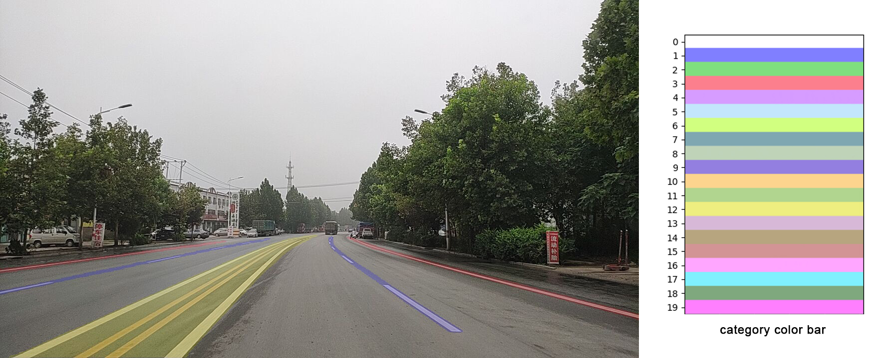

## Features

The script `convert_param.py` can be used to convert the pretrained model weights
from PyTorch to PaddlePaddle.

The script `visualization.py` can render an image with its corresponding labels (either
predicted results or groundtruth labels) for semantic visualization. Example is shown 
below. The color bar on the right hand side indicates the colors used for corresponding
categories.


Usage:
```Shell
python utils/visualization.py --img-dir path/to/image --label-dir path/to/label
```

More arguments can be found in the script.